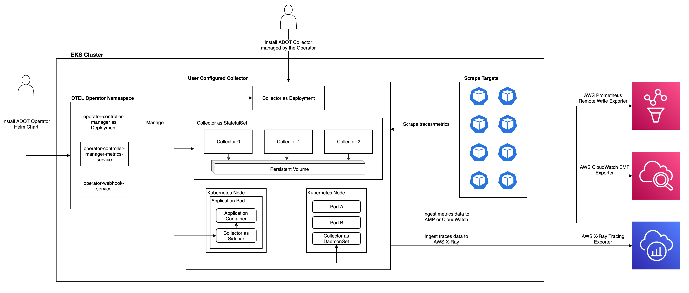

# Getting Started with the AWS Distro for OpenTelemetry EKS Add-On

## Introduction
Welcome to the getting started guide for the AWS Distro for OpenTelemetry (ADOT) Elastic Kubernetes Service (EKS) Add-On (now in public preview). Please note ADOT is generally available (GA) for tracing and in public preview for metrics. This guide covers AWS recommended approaches to:
* Instrument your applications on EKS
* Send metrics and traces to your preferred AWS monitoring service
* Set up ADOT components, including the Operator and Collector

This guide helps you set up ADOT components for the EKS Add-on user experience including the ADOT Operator and Collector. You will also learn how to install the ADOT EKS Add-On in your EKS cluster and how to configure the ADOT Collector followed by walkthrough of the set up and configuration required for collecting and sending metrics to CloudWatch and to the Amazon Managed Service for Prometheus (AMP) as well as sending traces to AWS X-Ray.

### Use Cases
Instead of a self managed experience that requires manual configuration, setup and deployment of the ADOT Collector in your EKS cluster, this ADOT EKS Add-On provides a simplified experience through native EKS APIs on command line to install the ADOT Operator inside your EKS cluster for your metrics and/or trace collection pipeline.

Use Cases supported by this add-on include:
* Configure, collect and send infrastructure and application metrics from EKS clusters and applications to either AMP or CloudWatch. This is done by using the ADOT Operator to launch the ADOT Collector which supports both OpenTelemetry protocol (OTLP) and Prometheus protocol data format compatibility.
* Configure, collect and send application traces from EKS to X-Ray using the OpenTelemetry protocol data format.

## Some Definitions

### What is an EKS Add-On?
An EKS Add-On is a service that makes it easy for users to set up software that supports specific capabilities for your EKS cluster. More information can be found on the [Amazon EKS add-ons](https://docs.aws.amazon.com/eks/latest/userguide/eks-add-ons.html) page.

Here is an end-to-end set up for a pipeline that utilizes the ADOT EKS Add-On.


*Diagram: EKS ADOT Add-On end to end pipeline*

### The ADOT Operator
The ADOT Operator is an implementation of a [Kubernetes Operator](https://cloud.redhat.com/learn/topics/operators). A Kubernetes Operator is a method of packaging, deploying and managing a Kubernetes-native application, which is deployed on Kubernetes and managed using the Kubernetes APIs and kubectl tooling. The Kubernetes Operator is a custom controller, which introduces new object types through Custom Resource Definition (CRD), an extension mechanism in Kubernetes. In this case, the CRD that is managed by the ADOT Operator is the ADOT Collector.

The ADOT Operator will watch for the Collector and is notified about its presence or modification. When the ADOT Operator receives this notification, it will start running in the following order. First, it will ensure that all the required connections between these requests and Kubernetes API server are actually available. Second, it will configure the Collector in the way the user expressed in the configuration file. The diagram below shows how the Collector CR request works in a Kubernetes cluster.


The EKS Add-On system maintains only the ADOT Operator that is updated through the add-on infrastructure (we will link to the EKS docs). Please note that the ADOT Collector is released and supported through the regular ADOT releases on [ECR](https://gallery.ecr.aws/aws-observability/aws-otel-collector). If you want to update your ADOT Collector version to the latest release, apply a new configuration via CRD with an updated image. If you have any questions please file these on [GitHub](https://github.com/aws-observability/aws-otel-community/issues).

## Install the ADOT EKS Add-On

### Prerequisites
* Use Kubernetes version is 1.19 or higher. You can verify the version you’re running with the following command.
    ```
    kubectl version | grep "Server Version"
    ``` 
  * See [this](https://kubernetes.io/docs/reference/kubectl/overview/) documentation for more information on `kubectl`
* Make sure that you can use kubectl with your EKS cluster by updating your `kubeconfig` if necessary:
    ```
    aws eks update-kubeconfig --name cluster_name --region <YOUR_AWS_REGION>
    ```
    * Replace `<YOUR_AWS_REGION>` with your own region, e.g. `us-west-2`
* Make sure AWS CLI v2 is installed:
    * [Install the AWS CLI](https://docs.aws.amazon.com/cli/latest/userguide/install-cliv2.html)
* Grant the permissions to EKS Add-ons for it to install ADOT. Apply the following permissions by running the command:
    ```
    kubectl apply -f \ https://amazon-eks.s3.amazonaws.com/docs/addons-otel-permissions.yaml
    ```
* Make sure the [TLS certificate](https://cert-manager.io/docs/) requirement is satisfied, as described in the next section. Note that the ADOT Operator is compatible with `cert-manager` versions <1.6.0. Please do not use version 1.6.0.

### TLS Certificate Requirement
The ADOT Operator uses admission [webhooks](https://kubernetes.io/docs/reference/access-authn-authz/webhook/) to mutate and validate the Collector Custom Resource (CR) requests. In Kubernetes, in order for the API server to communicate with the webhook component, the webhook requires a TLS certificate that the API server is configured to trust. There are three ways for you to generate the required TLS certificate. Please note that the cert-manager must be installed manually using one of the three options listed below. 

* The default method is to install the [cert-manager](https://cert-manager.io/docs/). In this way, cert-manager will generate a self-signed certificate. See [*cert-manager installation*](https://cert-manager.io/docs/installation/) for more details. Note that ADOT Operator is compatible with cert-manager version <1.6.0.
  * Please note that the users who require their own certificate management, will need to override the default configuration as stated in below two options.
* If you have your desired Certificate Authority (CA) or Issuer, you can also provide your own Issuer by configuring the `admissionWebhooks.certManager.issuerRef` value of the Operator Helm chart. You will need to specify the `kind` (Issuer or ClusterIssuer) and the name. For example, during Operator installation, you can provide `--set admissionWebhooks.certManager.issuerRef.kind=YOUR_ISSUER --set admissionWebhooks.certManager.issuerRef.name=YOUR_ISSUER_NAME` options. Note that this method also requires the installation of cert-manager.
    * Note that you can use a PCA via the cert-manager, more info can be found [here](https://docs.aws.amazon.com/acm-pca/latest/userguide/PcaWelcome.html)
* The third way is to manually modify the secret where the TLS certificate is stored. Make sure you set `admissionWebhooks.certManager.enabled` to `false` during the Operator installation.
    * Create the namespace for the OpenTelemetry Operator and the secret
    ```
    kubectl create namespace opentelemetry-operator-system
    ```
    * Config the TLS certificate using `kubectl create` command
    ```
    kubectl create secret tls opentelemetry-operator-controller-manager-service-cert --cert=path/to/cert/file --key=path/to/key/file -n opentelemetry-operator-system
    ```

If you want to learn more about certificate management, please read the **TLS certificate-related issues** section of [this](https://aws.amazon.com/blogs/opensource/building-a-helm-chart-for-deploying-the-opentelemetry-operator/) blog post. This blog post also provides more information and more resources regarding not just the cert-manager, but the Operator itself and Helm too.

### Installation
Install the ADOT EKS Add-On into your EKS cluster using:
```
aws eks create-addon --addon-name adot --cluster-name your-cluster-name
```
Here, we are using the AWS CLI for EKS with the `create-addon` command. The `--addon-name` is `adot` and our `--cluster-name` is the name of the cluster we want to install the Add-On into.

Check that our Add-On is up and running with the command:
```
aws eks describe-addon --addon-name adot --cluster-name your-cluster-name
```
Here, when you see that the status is active, meaning `"status": "ACTIVE"`, then the ADOT Operator exists in your cluster and is healthy.

### Using the ADOT Collector with the ADOT Operator
Once the ADOT EKS Add-On is set up, you can deploy your ADOT Collector into your EKS cluster. In general, the ADOT Collector which is managed by the Operator can be deployed in one of four modes: Deployment, Daemonset, StatefulSet, and Sidecar. For more information see [here](https://aws-otel.github.io/docs/getting-started/operator#step-2-install-adot-collector-as-kubernetes-custom-resource-to-your-eks-cluster).

#### Using IRSA to Launch your Collector
You can associate your IAM role to your EKS service account using IAM roles for service accounts (IRSA). Your service account can then provide AWS permissions to the containers you run in any pod that use that service account. More information about associating your IRSA roles can be found on the [IRSA documentation page](https://docs.aws.amazon.com/eks/latest/userguide/iam-roles-for-service-accounts.html).

#### Deploying the Collector
To deploy the Collector into your EKS cluster, use the command 
```
kubectl apply -f file-name
```
For example, if the configuration file you used was named `collector-config.yaml`, you would execute the command
```
kubectl apply -f collector-config.yaml
```
An example Collector configuration can be seen later in this guide under our “Examples” section. More details on how to use IRSA to launch your Collector will be provided as well.

## Step by Step Setup

### Set up your EKS Cluster and IAM Role
We will assume you have already had your EKS cluster ready. If not, you can refer to [Getting Started with Amazon EKS](https://docs.aws.amazon.com/eks/latest/userguide/getting-started.html) for more details. Make sure that your Kubernetes version is 1.19 or higher. Now, let’s attach the needed policies to your IAM role:
* Open your IAM console, select “Roles” in the left menu
* Search your EKS cluster name and you should see a role name like `eksctl-YOUR-CLUSTER-NAME-NodeInstanceRole-RANDOM-CHARACTERS`, select it
* Attach `AmazonAPIGatewayPushToCloudWatchLogs` and `AmazonPrometheusFullAccess` policies to this role

### Apply Permissions
```
kubectl apply -f https://amazon-eks.s3.amazonaws.com/docs/addons-otel-permissions.yaml
```
### Install cert-manager
In this tutorial, we will just use a self-signed certificate for TLS authentication. Run the following command to install cert-manager:
```
kubectl apply -f \ 
https://github.com/jetstack/cert-manager/releases/download/v1.1.0/cert-manager.yaml
```

Check if your cert-manager is ready with the following command. Make sure all the pods are running:
```
kubectl get pod -w -n cert-manager
```
### Install the ADOT Operator
Run the command to install the ADOT EKS Add-On, and the command to check if it is ready:
```
aws eks create-addon --addon-name adot --cluster-name your-cluster-name
aws eks describe-addon --addon-name adot --cluster-name your-cluster-name
```
Successful output should look something like this, note the `"status:"` field:
```
{
"addon": {
    "addonName": "adot",
    "clusterName": "your-cluster-name",
    "status": "ACTIVE",
    "addonVersion": "v0.29.0-eksbuild.1",
    "health": {
        "issues": []
    },
    "addonArn": "arn:aws:eks:us-west-2:195181405982:addon/adot/adot/9ebe61e2-824d-14c2-408e-c491a7cc5fb8",
    "createdAt": "2021-10-27T15:00:41.536000-07:00",
    "modifiedAt": "2021-10-27T15:01:24.104000-07:00",
    "tags": {}
    }
}
```

### IRSA Setup
To use IRSA, there are a couple of steps we need to complete.
*  First, create an IAM OIDC provider for your cluster by following the steps in the link below:
    * [Create an IAM OIDC provider for your cluster](https://docs.aws.amazon.com/eks/latest/userguide/enable-iam-roles-for-service-accounts.html)
* Next, create your service account and IAM role with the following command:
    ```
    eksctl create iamserviceaccount \
        --name adot-collector \
        --namespace default \
        --cluster <cluster_name> \
        --attach-policy-arn arn:aws:iam::aws:policy/AmazonPrometheusRemoteWriteAccess \
        --attach-policy-arn arn:aws:iam::aws:policy/AWSXrayWriteOnlyAccess \
        --attach-policy-arn arn:aws:iam::aws:policy/CloudWatchAgentServerPolicy \
        --approve \
        --override-existing-serviceaccounts
    ```
    * The `--name` flag specifies the name of the service account you want to create; for our example we will name it `adot-collector`
    * The `--namespace` flag specifies the namespace your service account will reside in; for our example we will use the `default` namespace
    * The `--cluster` flag specifies the `<cluster_name>`, which is the name of your cluster
    * The three `--attach-policy-arn` flags specify the ARNs of the three policies we need to attach, as listed below:
      * `arn:aws:iam::aws:policy/AmazonPrometheusRemoteWriteAccess`
      * `arn:aws:iam::aws:policy/AWSXrayWriteOnlyAccess`
      * `arn:aws:iam::aws:policy/CloudWatchAgentServerPolicy`


We will see in our collector configurations in the following sections that we add the `serviceAccount: adot-collector` field to our configuration to use IRSA.

This is the end of all the setup **before** we configure our collector. The next sections will detail what this looks like for AMP, CloudWatch, and X-Ray.

## Setup the ADOT Collector Configuration 
After the Operator application is running in your cluster, you can deploy the Collector as a custom resource. In the following sections, we will deploy a Collector in Deployment mode to scrape metrics and traces inside your EKS cluster and ingest the metrics and traces to AMP and CloudWatch for metrics and X-Ray for traces. These metrics and traces will be assumed to be received in OpenTelemetry Protocol (OTLP) format.

For more information about Collector configuration, as well as AMP, CloudWatch, and X-Ray exporter configurations, refer to the documentation below:
* [Collector configuration](https://github.com/open-telemetry/opentelemetry-operator/blob/main/docs/otelcol_cr_spec.md)
* [AMP configuration](https://github.com/open-telemetry/opentelemetry-collector-contrib/tree/main/exporter/awsprometheusremotewriteexporter#readme)
* [CloudWatch configuration](https://github.com/open-telemetry/opentelemetry-collector-contrib/tree/main/exporter/awsemfexporter#readme)
* [X-Ray configuration](https://github.com/open-telemetry/opentelemetry-collector-contrib/tree/main/exporter/awsxrayexporter#readme)

## Setup for sending metrics to Amazon Managed Service for Prometheus (AMP)

### Create your AMP Workspace
* Open your AMP console at https://console.aws.amazon.com/prometheus/home
* Type the name for your workspace and click create button

The Collector configuration below is set up to receive OTLP metrics and export to AMP. 

```yaml
apiVersion: opentelemetry.io/v1alpha1
kind: OpenTelemetryCollector
metadata:
  name: my-collector
spec:
  image: "public.ecr.aws/aws-observability/aws-otel-collector:v0.14.0"
  mode: deployment # This configuration is omittable.
  serviceAccount: adot-collector
  config: |
    receivers:
      otlp:
        protocols:
          grpc:
            endpoint: 0.0.0.0:4317
    processors:

    exporters:
      awsprometheusremotewrite:
        endpoint: <YOUR_REMOTE_WRITE_ENDPOINT>
        aws_auth:
          region: <YOUR_AWS_REGION>
          service: "aps"

    service:
      pipelines:
        metrics:
          receivers: [otlp]
          processors: []
          exporters: [awsprometheusremotewrite]
```
Save this into a file called `collector-config-amp.yaml` and execute the command below to deploy your Collector.
```
kubectl apply -f collector-config-amp.yaml
```
Remember to substitute the AMP remote write endpoint and the AMP region with your own. 

### Verify if the Metrics Data is being sent to AMP using the awscurl tool
Use `awscurl` to check if AMP received the metrics data. The `awscurl` tool is a curl like tool with AWS Signature Version 4 request signing. It performs requests to AWS services with requests signing using curl interface, and it supports IAM profile credentials. To learn more about `awscurl`, please refer to its [Github repository](https://github.com/okigan/awscurl).

To install `awscurl`, follow the documentation [here](https://github.com/okigan/awscurl/blob/master/README.md#installation).

Run the following command to check if AMP received the metrics data `actualQueueSize`. You can also query other metrics data. Again, remember to replace the region and workspace ID with your own.
```
awscurl --service="aps" --region="YOUR_AWS_REGION" \
"https://aps-workspaces.YOUR_AWS_REGION.amazonaws.com/workspaces/YOUR_AMP_WORKSPACE_ID/api/v1/query?query=actualQueueSize"
```
Make sure to replace the `YOUR_AWS_REGION` fields and `YOUR_AMP_WORKSPACE_ID` fields.

Your output should look something like this:
```
{"status":"success","data":{"resultType":"vector","result":[{"metric":{"__name__":"actualQueueSize","apiName":"/outgoing-http-call","statusCode":"200"},"value":[1636012536.152,"0"]}]}}
```
## Setup for sending metrics to CloudWatch
The Collector configuration below is set up to receive OTLP metrics and export to CloudWatch. 

```yaml
apiVersion: opentelemetry.io/v1alpha1
kind: OpenTelemetryCollector
metadata:
  name: my-collector
spec:
  image: "public.ecr.aws/aws-observability/aws-otel-collector:v0.14.0"
  mode: deployment # This configuration is omittable.
  serviceAccount: adot-collector
  config: |
    receivers:
      otlp:
        protocols:
          grpc:
            endpoint: 0.0.0.0:4317
    processors:

    exporters:
      awsemf:
        region: <YOUR_AWS_REGION>

    service:
      pipelines:
        metrics:
          receivers: [otlp]
          processors: []
          exporters: [awsemf]

```
Save this into a file called `collector-config-cloudwatch.yaml` and execute the command below to deploy your Collector.
```
kubectl apply -f collector-config-cloudwatch.yaml
```
Remember to substitute the CloudWatch region with your own. 

### Verify if the Metrics Data is being sent to CloudWatch
* Open the CloudWatch console
* Select “Logs → Log groups” in the menu on the left
* Click “/metrics/AOCDockerDemo/AOCDockerDemoService” log group
* Click “otel-stream” log stream
* See if your metrics data is there

## Setup for sending traces to AWS X-Ray
The Collector configuration below is set up to receive OTLP traces and export to X-Ray. 

```yaml
apiVersion: opentelemetry.io/v1alpha1
kind: OpenTelemetryCollector
metadata:
  name: my-collector
spec:
  image: "public.ecr.aws/aws-observability/aws-otel-collector:v0.14.0"
  mode: deployment # This configuration is omittable.
  serviceAccount: adot-collector
  config: |
    receivers:
      otlp:
        protocols:
          grpc:
            endpoint: 0.0.0.0:4317
    processors:

    exporters:
      awsxray:
        region: <YOUR_AWS_REGION>

    service:
      pipelines:
        traces:
          receivers: [otlp]
          processors: []
          exporters: [awsxray]

```
Save this into a file called `collector-config-xray.yaml` and execute the command below to deploy your Collector.
```
kubectl apply -f collector-config-xray.yaml
```
Remember to substitute the X-Ray region with your own. 

### Verify that Trace Data is being sent to X-Ray
* Open the X-Ray console
* Select “Traces” in the menu on the left
* See if your Trace data is there

## Setup the Sample Application

### Setup  your application within your EKS Cluster
To illustrate this setup, we are using a sample application within your EKS cluster. This sample application, along with a traffic generator, will generate metrics and traces and are configured to send them to the Collector. Here are the .yaml configurations for these applications; we will call the traffic generator file `traffic-generator.yaml` and the sample app file `sample-app.yaml`.

`traffic-generator.yaml`:
```yaml
apiVersion: v1
kind: Service
metadata:
  labels:
    io.kompose.service: traffic-generator
  name: traffic-generator
spec:
  ports:
    - name: "80"
      port: 80
      targetPort: 80
  selector:
    io.kompose.service: traffic-generator
status:
  loadBalancer: {}
---
apiVersion: apps/v1
kind: Deployment
metadata:
  labels:
    io.kompose.service: traffic-generator
  name: traffic-generator
spec:
  replicas: 1
  selector:
    matchLabels:
      io.kompose.service: traffic-generator
  strategy: {}
  template:
    metadata:
      labels:
        io.kompose.service: traffic-generator
    spec:
      containers:
        - args:
            - /bin/bash
            - -c
            - sleep 10; while :; do curl ot-sample-app:4567/outgoing-http-call > /dev/null 1>&1; sleep 2; curl ot-sample-app:4567/aws-sdk-call > /dev/null 2>&1; sleep 5; done
          image: ellerbrock/alpine-bash-curl-ssl:latest
          name: traffic-generator
          ports:
            - containerPort: 80
          resources: {}
      restartPolicy: Always
status: {}
```
`sample-app.yaml`:
```yaml
apiVersion: v1
kind: PersistentVolumeClaim
metadata:
  labels:
    io.kompose.service: ot-sample-app-claim0
  name: ot-sample-app-claim0
spec:
  accessModes:
    - ReadWriteOnce
  resources:
    requests:
      storage: 100Mi
status: {}
---
apiVersion: v1
kind: Service
metadata:
  labels:
    io.kompose.service: ot-sample-app
  name: ot-sample-app
spec:
  ports:
    - name: "4567"
      port: 4567
      targetPort: 4567
  selector:
    io.kompose.service: ot-sample-app
status:
  loadBalancer: {}
---
apiVersion: apps/v1
kind: Deployment
metadata:
  labels:
    io.kompose.service: ot-sample-app
  name: ot-sample-app
spec:
  replicas: 1
  selector:
    matchLabels:
      io.kompose.service: ot-sample-app
  strategy:
    type: Recreate
  template:
    metadata:
      labels:
        io.kompose.service: ot-sample-app
    spec:
      containers:
        - env:
            - name: AWS_REGION
              value: us-west-2
            - name: LISTEN_ADDRESS
              value: 0.0.0.0:4567
            - name: OTEL_EXPORTER_OTLP_ENDPOINT
              value: http://my-collector-collector:4317
            - name: OTEL_RESOURCE_ATTRIBUTES
              value: service.namespace=AOCDockerDemo,service.name=AOCDockerDemoService
          image: public.ecr.aws/aws-otel-test/aws-otel-java-test-spark:v0.11.0
          name: ot-sample-app
          ports:
            - containerPort: 4567
          resources: {}
          volumeMounts:
            - mountPath: /root/.aws
              name: ot-sample-app-claim0
      restartPolicy: Always
      volumes:
        - name: ot-sample-app-claim0
  persistentVolumeClaim:
status: {}
```
The sample application and traffic generator were largely taken from an example in the ADOT Collector repository, linked [here](https://github.com/aws-observability/aws-otel-collector/blob/main/examples/docker/docker-compose.yaml). This `docker-compose.yaml` file was translated to the Kubernetes resources you see above using the [Kompose](https://kompose.io/) tool. More information about Kompose can be viewed on their website https://kompose.io/.

Execute these commands to add both the traffic generator and sample app into your cluster:
```
kubectl apply -f traffic-generator.yaml
kubectl apply -f sample-app.yaml
```

## Putting it all Together
The below configuration combines the three Collector configurations for AMP, CloudWatch, and X-Ray into one configuration file. 

```yaml
apiVersion: opentelemetry.io/v1alpha1
kind: OpenTelemetryCollector
metadata:
  name: my-collector
spec:
  image: "public.ecr.aws/aws-observability/aws-otel-collector:v0.14.0"
  mode: deployment # This configuration is omittable.
  serviceAccount: adot-collector
  config: |
    receivers:
      otlp:
        protocols:
          grpc:
            endpoint: 0.0.0.0:4317
    processors:

    exporters:
      awsprometheusremotewrite:
        endpoint: <YOUR_REMOTE_WRITE_ENDPOINT>
        aws_auth:
          region: <YOUR_AWS_REGION>
          service: "aps"
      awsemf:
        region: <YOUR_AWS_REGION>
      awsxray:
        region: <YOUR_AWS_REGION>

    service:
      pipelines:
        traces:
          receivers: [otlp]
          processors: []
          exporters: [awsxray]
        metrics:
          receivers: [otlp]
          processors: []
          exporters: [awsprometheusremotewrite, awsemf]
```

Copy the contents into a file named `collector-config.yaml`. Execute the command 
```
kubectl apply -f collector-config.yaml
```

## Cleanup
Delete the Collector resource:
```
kubectl delete -f collector-config.yaml
```
Delete your sample app and traffic generator:
```
kubectl delete -f traffic-generator.yaml
kubectl delete -f sample-app.yaml
```
Uninstall the ADOT EKS Add-On:
```
aws eks delete-addon --addon-name adot --cluster-name your-cluster-name
```
* Note that after uninstalling the ADOT EKS Add-On, if you want to install the Add-On again, you must reinstall permissions first, as seen in the **Apply Permissions** section of the example.

Uninstall the cert-manager by following the instructions [here](https://cert-manager.io/docs/installation/kubectl/#uninstalling).

## Questions or bugs?

Technical documentation is available on the AWS Distro for OpenTelemetry [developer site](https://aws-otel.github.io/), and you can [download the distribution from GitHub](https://aws-otel.github.io/download). You can also download the latest [ADOT Collector image](https://gallery.ecr.aws/aws-observability/aws-otel-collector) from the [Amazon Elastic Container Registry (Amazon ECR)](https://aws.amazon.com/ecr/) Public Gallery.

To learn more about how you can use AWS Distro for OpenTelemetry (ADOT) to collect data for your observability solution, check out the hands-on [AWS Observability workshop](https://catalog.us-east-1.prod.workshops.aws/v2/workshops/31676d37-bbe9-4992-9cd1-ceae13c5116c/en-US/adot). If you have questions about the distribution, features, or components, file an [issue](https://github.com/aws-observability/aws-otel-community/issues).
